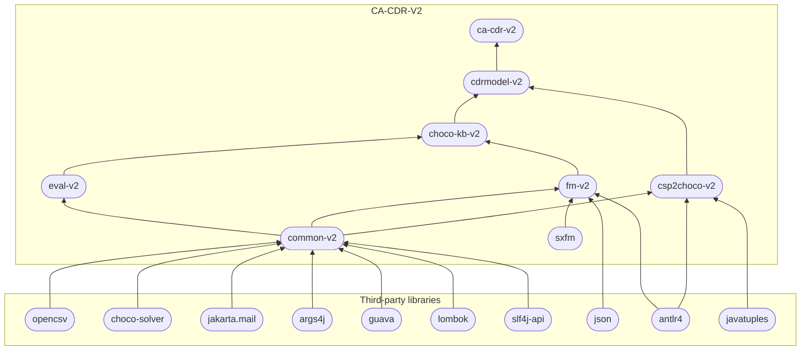

# CA-CDR-V2
{: .no_toc }
{: .d-inline-block }

v1.3.9-alpha-52
{: .label .label-purple }

**CA-CDR-V2** is a Java library for **Consistency-based Algorithms for Conflict Detection and Resolution** (CA-CDR).

{: .highlight }
**Conflict Detection and Resolution** is a substantial task in **Knowledge Base Engineering** (KBE).
Intelligent mechanisms are urgently needed, especially in large-scale knowledge bases.
This repository publishes our implementations for some/our consistency-based algorithms,
which can be utilized in all three phases of KBE, i.e., _design_, _testing and debugging_,
and _configuration_.

## List of algorithms:

1. [QuickXPlain](https://github.com/manleviet/CA-CDR-V2/blob/main/ca-cdr-package/src/main/java/at/tugraz/ist/ase/cacdr/algorithms/QuickXPlain.java) [1]
2. [FastDiag](https://github.com/manleviet/CA-CDR-V2/blob/main/ca-cdr-package/src/main/java/at/tugraz/ist/ase/cacdr/algorithms/FastDiagV2.java) [2]
3. [MSS-based FastDiag](https://github.com/manleviet/CA-CDR-V2/blob/main/ca-cdr-package/src/main/java/at/tugraz/ist/ase/cacdr/algorithms/FastDiagV3.java) [15]
4. [FlexDiag](https://github.com/manleviet/CA-CDR-V2/blob/main/ca-cdr-package/src/main/java/at/tugraz/ist/ase/cacdr/algorithms/FlexDiag.java) [3]
5. [HS-tree](https://github.com/manleviet/CA-CDR-V2/blob/main/ca-cdr-package/src/main/java/at/tugraz/ist/ase/cacdr/algorithms/hs/HSTree.java) [8]
6. [HSDAG](https://github.com/manleviet/CA-CDR-V2/blob/main/ca-cdr-package/src/main/java/at/tugraz/ist/ase/cacdr/algorithms/hs/HSDAG.java) [9]
7. [DirectDebug](https://github.com/manleviet/CA-CDR-V2/blob/main/ca-cdr-package/src/main/java/at/tugraz/ist/ase/cacdr/algorithms/DirectDebug.java) [4, 5, 6, 7]
8. (coming soon) DirectDiag - [third_release](https://github.com/manleviet/CA-CDR-V2/blob/third_release/ca-cdr-package/src/main/java/at/tugraz/ist/ase/cacdr/algorithms/DirectDiag.java)
9. (coming soon) WipeOutR_T [12, 13]
10. (coming soon) WipeOutR_FM [12, 13] - [third_release](https://github.com/manleviet/CA-CDR-V2/blob/third_release/ca-cdr-package/src/main/java/at/tugraz/ist/ase/cacdr/algorithms/WipeOutR_FM.java)
11. (coming soon) AggregatedTest [14]
12. (coming soon) LevelWiseParallelHSDAG [10, 11]
13. (coming soon) FullParallelHSDAG [10, 11]
14. (coming soon) FastDiagP [15] - [Python implementation](https://github.com/manleviet/PyFastDiagP-ver2)
15. (coming soon) KBDiag [the related paper submitted on January 2023]
16. (coming soon) InformedQX
17. (coming soon) ParallelWipeOutR_T
18. (coming soon) ParallelWipeOutR_FM

This package also provides a [Choco Consistency Checker](https://github.com/manleviet/CA-CDR-V2/blob/main/ca-cdr-package/src/main/java/at/tugraz/ist/ase/cacdr/checker/ChocoConsistencyChecker.java), supporting the consistency checks for sets of constraints or sets of test cases.

### Examples
{: .no_toc }

There are some test models in [here](https://github.com/manleviet/CDRModel/tree/main/src/main/java/at/tugraz/ist/ase/cdrmodel/test/model) and some examples, showing how to use these algorithms, in [here](https://github.com/manleviet/CA-CDR/tree/main/src/test/java/at/tugraz/ist/ase/cacdr/algorithms).

## What CA-CDR-V2 provide

The library is organized in 7 following Maven packages:

| *package*                                       | *description*                            |
|----------------------------------------------|------------------------------------------|
| [ca-cdr-v2]     | provides implementations of Consistency-based Algorithms for Conflict Detection and Resolution (CA-CDR) and a ChocoConsistencyChecker |
| [cdrmodel-v2] | provides an programmatic approach to manage/prepare the constraints/test cases for consistency-based algorithms |
| [choco-kb-v2]    | provides classes managing CSP (Choco) representations of a knowlege base/feature model |
| [fm-v2]         | provides the management functionalities for basic feature models |
| [eval-v2]     | provides a performance evaluator, i.e., counters and timers, which could be used to measure the performance of algorithms |
| [csp2choco-v2] | provides a translator which enables converting CSP constraints into Choco Solver commands |
| [common-v2] | a Maven package for utility functions |

<!-- provides core functionalities related to knolwedge base testing and debugging tasks -->

The following diagram shows the packages' dependency.

<!-- Links -->
[References]: /references
[ca-cdr-v2]: algorithms
[cdrmodel-v2]: cdrmodel
[choco-kb-v2]: kb
[fm-v2]: fm
[eval-v2]: eval
[csp2choco-v2]: csp2choco
[common-v2]: common-utils