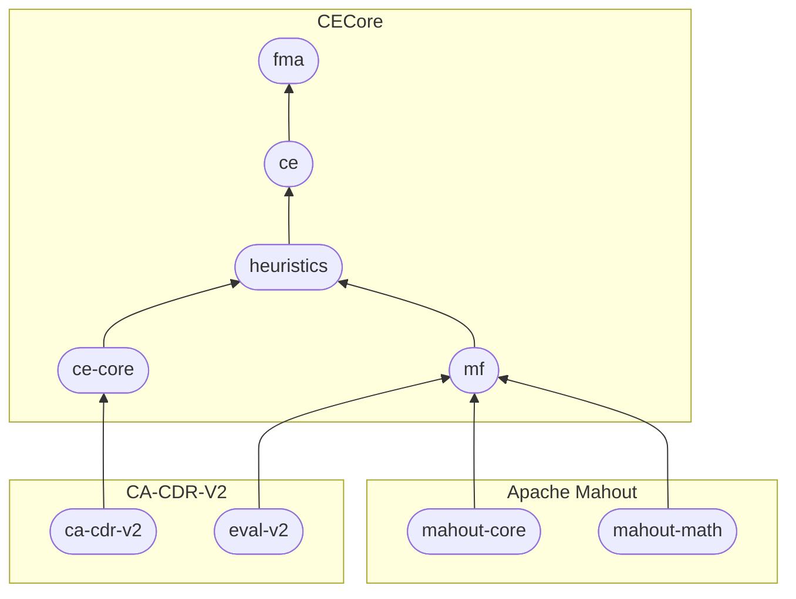

# CECore
{: .d-inline-block }

v1.1.2-alpha-10
{: .label .label-purple }

**CECore** is a Java library providing core components of [knowledge-based configuration systems].

## What CECore provide

It is structured in 5 following Maven packages:

| *package*                                       | *description*                            |
|:----------------------------------------------|:------------------------------------------|
| [ce-core]     | core and utility classes |
| [ce] | provides a compact knolwedge-based configurator |
| [fma]    | provides a mechnism to automatically generate property-based test cases for feature models and allows the automated determination of faulty constraints in the feature model |
| [heuristics]         | provides an implementation of Matrix Factorization Based Variable and Value Ordering Heuristics for Constraint Solving |
| [mf]      | provides an implementation of Matrix Factorization using the Mahout library. |

The following diagram shows the packages' dependency.

<!-- Links -->
[ce-core]: core
[ce]: ce
[fma]: fma
[heuristics]: heuristics
[mf]: mf
[knowledge-based configuration systems]: https://en.wikipedia.org/wiki/Knowledge-based_configuration