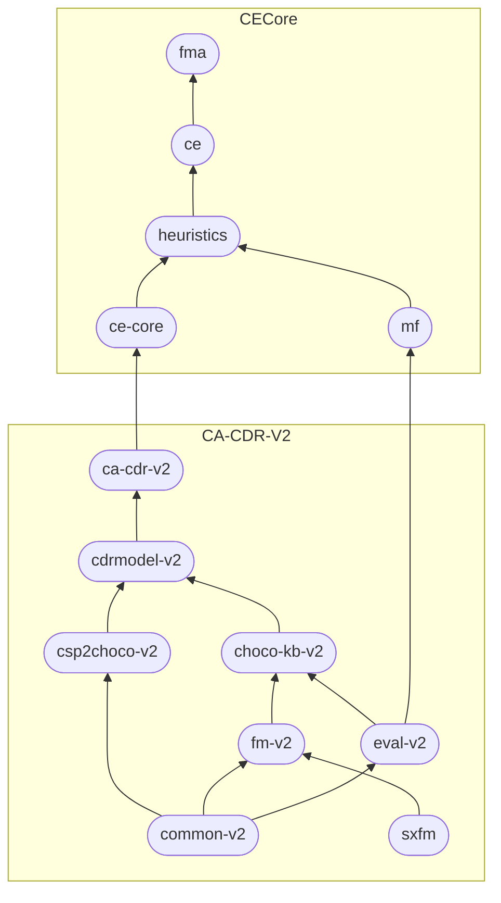

# How to get the packages
{: .no_toc }

We publish **CA-CDR-V2** and **CECore** libraries in Maven packages hosted by [GitHub Packages].
In this page, you'll find how to import these Maven packages into your Java project.

## Table of Contents
{: .no_toc .text-delta }

1. TOC
{:toc}

## Authenticating to GitHub Packages

In your Maven project, please add the below script in the `settings.xml` file.



<?xml version="1.0" encoding="UTF-8"?>
<settings xmlns="http://maven.apache.org/SETTINGS/1.0.0"
    xmlns:xsi="http://www.w3.org/2001/XMLSchema-instance"
    xsi:schemaLocation="http://maven.apache.org/SETTINGS/1.0.0 http://maven.apache.org/xsd/settings-1.0.0.xsd">
    <servers>
        <server>
            <id>github-maven-repository</id>
            <username>USERNAME</username>
            <password>TOKEN</password>
        </server>
    </servers>
</settings>





Replacing `USERNAME` with your GitHub username, and `TOKEN` with your personal access token (see [Creating a personal access token]).

## Connecting to our repositories

Add also the below script into the `pom.xml` file:



<profiles>
    <profile>
        <id>github-maven-repository</id>
        <repositories>
            <repository>
                <id>github-maven-repository</id>
                <url>https://maven.pkg.github.com/manleviet/*</url>
            </repository>
        </repositories>
    </profile>
</profiles>





## Installing the packages

Add the package dependencies to the `dependencies` element of your project `pom.xml` file.



<dependency>
    <groupId>at.tugraz.ist.ase</groupId>
    <artifactId>ARTIFACT_ID</artifactId>
    <version>VERSION</version>
</dependency>





Replacing `ARTIFACT_ID` and `VERSION` with the corresponding information from the following table.
_Legend_: stable version{: .label .label-green .fs-1 } latest version{: .label .label-purple .fs-1 }

|*library* | *artifact_id*                                       | *versions* | *description*                            |
|:---|:----------------------------------------------|:------------------------------------------|:---|
| **CA-CDR-V2** | [ca-cdr-v2]  | 1.3.8{: .label .label-green .fs-1 } 1.3.9-alpha-53{: .label .label-purple .fs-1 .lowercase } | provides implementations of Consistency-based Algorithms for Conflict Detection and Resolution (CA-CDR) and a ChocoConsistencyChecker |
| - | [cdrmodel-v2] | 1.3.8{: .label .label-green .fs-1 } 1.3.9-alpha-53{: .label .label-purple .fs-1 } | provides an programmatic approach to manage/prepare the constraints/test cases for consistency-based algorithms |
| - | [choco-kb-v2]    | 1.3.8{: .label .label-green .fs-1 } 1.3.9-alpha-53{: .label .label-purple .fs-1 } | provides classes managing CSP (Choco) representations of a knowlege base/feature model |
| - | [fm-v2]         | 1.3.8{: .label .label-green .fs-1 } 1.3.9-alpha-53{: .label .label-purple .fs-1 } | provides the management functionalities for basic feature models |
| - | [eval-v2]      | 1.3.8{: .label .label-green .fs-1 } 1.3.9-alpha-53{: .label .label-purple .fs-1 } | provides a performance evaluator, i.e., counters and timers, which could be used to measure the performance of algorithms |
| - | [csp2choco-v2] | 1.3.8{: .label .label-green .fs-1 } 1.3.9-alpha-53{: .label .label-purple .fs-1 } | provides a translator which enables converting CSP constraints into Choco Solver commands |
| - | [common-v2] | 1.3.8{: .label .label-green .fs-1 } 1.3.9-alpha-53{: .label .label-purple .fs-1 } | a Maven package for utility functions |
|**CECore** | [ce-core]     | 1.1.1{: .label .label-green .fs-1 } 1.1.2-alpha-11{: .label .label-purple .fs-1 } | core and utility classes |
| - | [ce] | 1.1.1{: .label .label-green .fs-1 } 1.1.2-alpha-11{: .label .label-purple .fs-1 } | provides a compact knolwedge-based configurator |
| -  | [fma]    | 1.1.1{: .label .label-green .fs-1 } 1.1.2-alpha-11{: .label .label-purple .fs-1 } | provides a mechnism to automatically generate property-based test cases for feature models and allows the automated determination of faulty constraints in the feature model |
| - | [heuristics]         | 1.1.1{: .label .label-green .fs-1 } 1.1.2-alpha-11{: .label .label-purple .fs-1 } | provides an implementation of Matrix Factorization Based Variable and Value Ordering Heuristics for Constraint Solving |
| - | [mf]      | 1.1.1{: .label .label-green .fs-1 } 1.1.2-alpha-11{: .label .label-purple .fs-1 } | provides an implementation of Matrix Factorization using the Mahout library. |

## Dependency of two libraries

<!-- Links -->
[ca-cdr-v2]: https://github.com/manleviet/CA-CDR-V2/packages/1417091
[cdrmodel-v2]: https://github.com/manleviet/CA-CDR-V2/packages/1408661
[choco-kb-v2]: https://github.com/manleviet/CA-CDR-V2/packages/1408660
[fm-v2]: https://github.com/manleviet/CA-CDR-V2/packages/1408657
[eval-v2]: https://github.com/manleviet/CA-CDR-V2/packages/1408656
[csp2choco-v2]: https://github.com/manleviet/CA-CDR-V2/packages/1408654
[common-v2]: https://github.com/manleviet/CA-CDR-V2/packages/1408257
[ce-core]: https://github.com/manleviet/CECore/packages/1538019
[ce]: https://github.com/manleviet/CECore/packages/1538662
[fma]: https://github.com/manleviet/CECore/packages/1564988
[heuristics]: https://github.com/manleviet/CECore/packages/1538660
[mf]: https://github.com/manleviet/CECore/packages/1538658
[Creating a personal access token]: https://docs.github.com/en/authentication/keeping-your-account-and-data-secure/creating-a-personal-access-token
[GitHub Packages]: https://github.com/features/packages