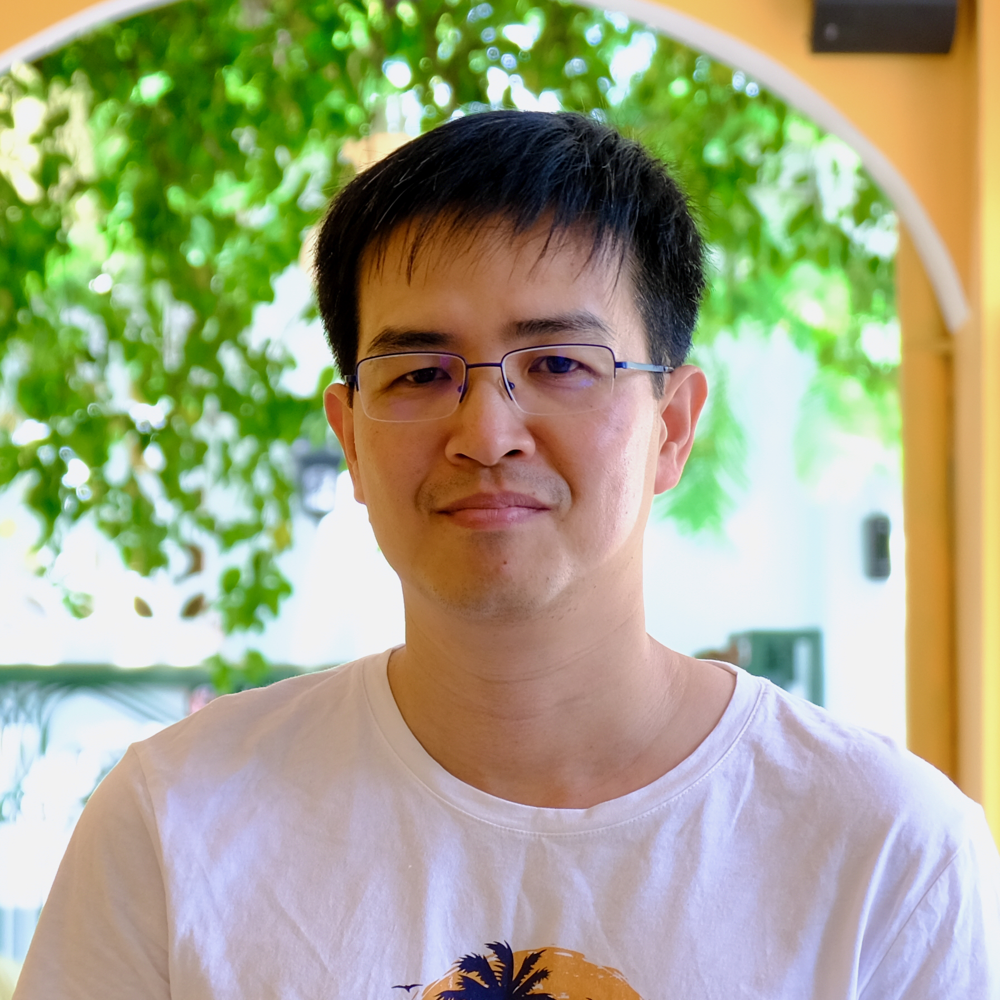

Hi👋! I am a researcher working on Knowledge-based Diagnosis, Configuration Systems, and Explanations in AI. I am currently finishing my PhD at the <a target="_blank" href="https://www.tugraz.at/institute/ist/home">Institute of Software Engineering and Artificial Intelligence</a> of <a target="_blank" href="https://www.tugraz.at/">Graz University of Technology</a> (TU Graz), Austria.

Under the supervision of <a target="_blank" href="https://ase.ist.tugraz.at/staff/alexander-felfernig/">Professor Alexander Felfernig</a>, my doctoral research — *Intelligent Techniques for Efficient Diagnostic Reasoning in Constraint-Based Systems* — develops solver-agnostic algorithms for Conflict Detection, Direct Diagnosis, and automated Debugging that scale to industrial Configuration Systems and Feature Models. More recent work extends these foundations toward Causality-based Explanations and Large Language Models for Software Product Line Engineering.

Before joining TU Graz in 2020, I spent more than 15 years as a lecturer and researcher at the <a target="_blank" href="https://hce.edu.vn/">University of Economics, Hue University</a>, Vietnam, where I taught and conducted research in the Faculty of Economic Information Systems. I obtained my Master of Computer Science (2008–2011) at the <a target="_blank" href="https://ifi.auf.org/">Institute for Informatics in French-speaking areas</a> (IFI), Vietnam, with double diplomas from the <a target="_blank" href="https://www.univ-larochelle.fr/">University of La Rochelle</a>, France, and <a target="_blank" href="https://hust.edu.vn/">Hanoi University of Science and Technology</a>, Vietnam. During my Master's study, I worked on Machine Learning, Content-based Information Retrieval, and Information Visualization, and completed my Master's thesis — an image browser based on Self-Organizing Maps — as part of an internship at the <a target="_blank" href="https://uclouvain.be/">Catholic University of Louvain</a>, Belgium, under the supervision of <a target="_blank" href="https://www.uclouvain.be/en/people/michel.verleysen">Professor Michel Verleysen</a>.

I am now looking forward to research positions in academia and industry where I can continue working on Explainability, Knowledge-based Reasoning, and the integration of symbolic and learning-based methods.

## News

- **May 2026** — Received funding from the *Projektfonds Lehre 2026* (TU Graz Vice-Rectorate for Teaching) for our project, which uses LLMs to analyze anonymized student submissions from the *Introduction to Structured Programming* course and propose targeted didactic improvements for the upcoming summer semester.

- **March 2026** — Presented our paper [**Early-Stage Product Line Validation Using LLMs: A Study on Semi-Formal Blueprint Analysis**](#) at the *41st ACM/SIGAPP Symposium on Applied Computing* ([SAC 2026](https://www.sigapp.org/sac/sac2026/)), Thessaloniki, Greece.

- **March 2026** — Our paper [**Robust Lazy Conflict Detection via Multi-Conflict Extraction and Genetic Diversity Control**](https://ojs.aaai.org/index.php/AAAI/article/view/38995) is published in the *Proceedings of the AAAI Conference on Artificial Intelligence* (vol. 40, no. 23).

- **January 2026** — Presented [**Robust Lazy Conflict Detection via Multi-Conflict Extraction and Genetic Diversity Control**](https://ojs.aaai.org/index.php/AAAI/article/view/38995) at the *40th AAAI Conference on Artificial Intelligence* ([AAAI 2026](https://aaai.org/conference/aaai/aaai-26/)), Singapore.

- **October 2025** — Chaired the [**27th International Workshop on Configuration (ConfWS 2025)**](https://confws.github.io/2025/), co-located with the [28th European Conference on Artificial Intelligence (ECAI 2025)](https://ecai2025.org), Bologna, Italy.

## Selected Publications

**Robust Lazy Conflict Detection via Multi-Conflict Extraction and Genetic Diversity Control**

**Viet-Man Le**, Lukas A. Feldgrill, Alexander Felfernig

*Proceedings of the AAAI Conference on Artificial Intelligence*, vol. 40, no. 23, pp. 19208–19215. **CORE A*** (2026)

**Learning Constraint Orderings for Direct Diagnosis**

Mathias Uta, **Viet-Man Le**, Alexander Felfernig, Denis Helic

*Journal of Intelligent Information Systems*, vol. 63, no. 5, pp. 1753–1777. **SCIMAGO Q2** (2025)

**InformedQX: Informed Conflict Detection for Over-Constrained Problems**

**Viet-Man Le**, Alexander Felfernig, Thi Ngoc Trang Tran, Mathias Uta

*Proceedings of the 38th AAAI Conference on Artificial Intelligence*, vol. 38, no. 9, pp. 10616–10623. **CORE A*** (2024)

**FastDiagP: An Algorithm for Parallelized Direct Diagnosis**

**Viet-Man Le**, Cristian Vidal Silva, Alexander Felfernig, David Benavides, José Galindo, Thi Ngoc Trang Tran

*Proceedings of the 37th AAAI Conference on Artificial Intelligence*, vol. 37, no. 5, pp. 6442–6449. **CORE A*** (2023)

**DirectDebug: Automated Testing and Debugging of Feature Models**

**Viet-Man Le**, Alexander Felfernig, Mathias Uta, David Benavides, José Galindo, Thi Ngoc Trang Tran

*Proceedings of the ACM/IEEE 43rd International Conference on Software Engineering: New Ideas and Emerging Results (ICSE-NIER 2021)*, pp. 81–85. **CORE A*** (2021)

See the [full list of publications](publications.html).
